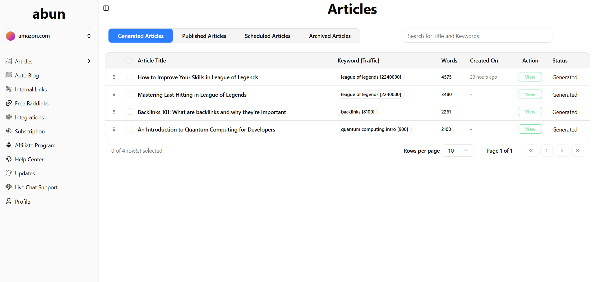
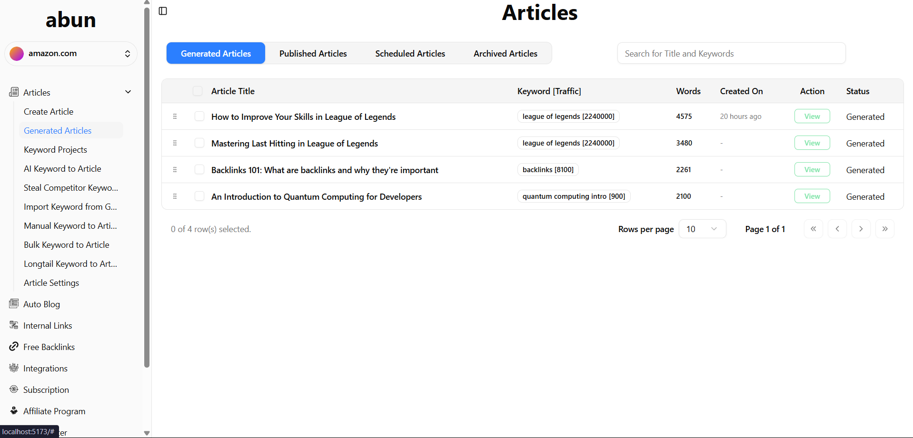
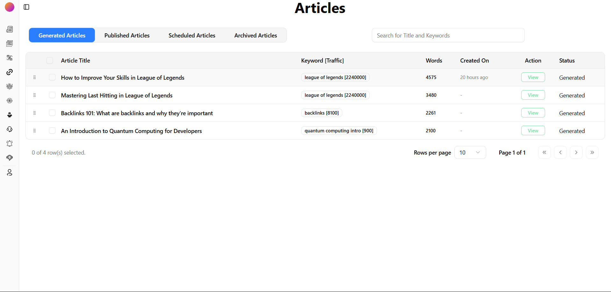
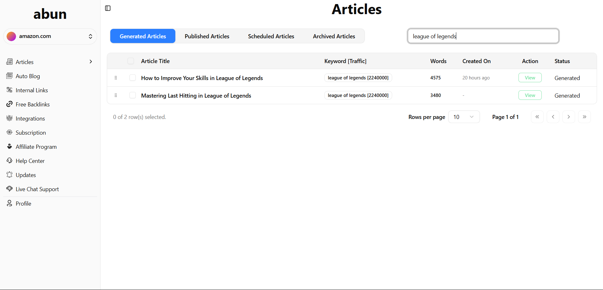
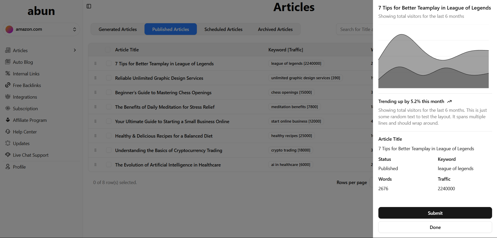
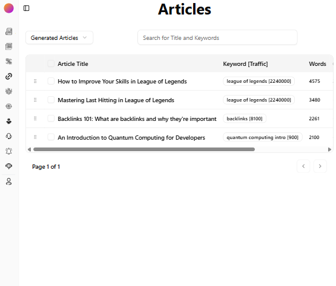
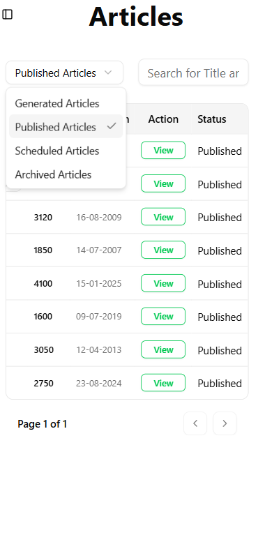
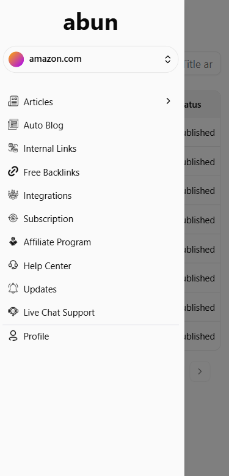
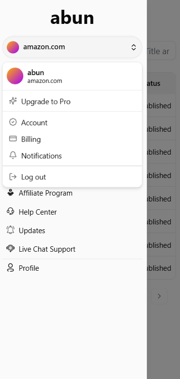

# **Creatiwise Dashboard**

_An elegant and responsive dashboard interface built using React, Vite, Tailwind CSS, and ShadCN/UI blocks. This project was developed as part of an internship assignment for Creatiwise, focusing on implementing modern UI components such as **sidebar-07** and **dashboard-01.**_

## ✨ <ins>Features</ins>

#### 👉🏻 Collapsible Sidebar (sidebar-07): A sleek sidebar that collapses to icons, enhancing navigation and saving screen space.

#### 👉🏻 Dashboard Layout (dashboard-01): A comprehensive dashboard layout featuring analytics cards, charts, and data tables.

#### 👉🏻 Responsive Design: Ensures optimal viewing experience across devices.

#### 👉🏻 Modern Tech Stack: Utilizes React, Vite, Tailwind CSS, and ShadCN/UI for efficient and scalable development.

# 🚀Getting Started

## ℹ️Installation

#### 👉🏻 Clone the repository (Run)

    git clone https://github.com/abdev4435/creatiwise-dashboard.git
    cd creatiwise-dashboard

#### 👉🏻 Install dependencies

    npm install

#### 👉🏻 Start the development server

    npm run dev

#### 👉🏻 Start the development server

    Navigate to "http://localhost:5173"

## 📸<ins>Screenshots</ins>

### 🖥️Big Screens

#### 👇🏻Main Screen

#### 👇🏻Sidebar on Hovering subitems

#### 👇🏻Collapsed Sidebar

#### 👇🏻Search bar functionality

#### 👇🏻View Article Functionality

### 📱Small Screens

#### 👇🏻Mini Tablet View

#### 👇🏻Article Tabs on small screen

#### 👇🏻Sidebar

#### 👇🏻View Functionality on small screen

Developed with ❤️ by _Abdullah Surve_ as part of the Creatiwise internship assignment.
